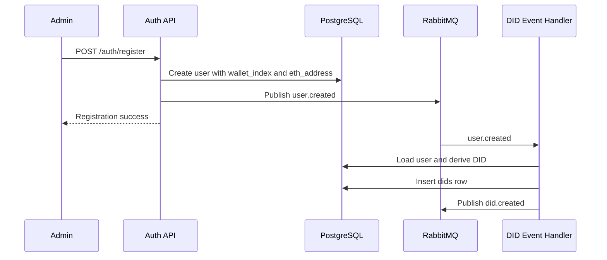
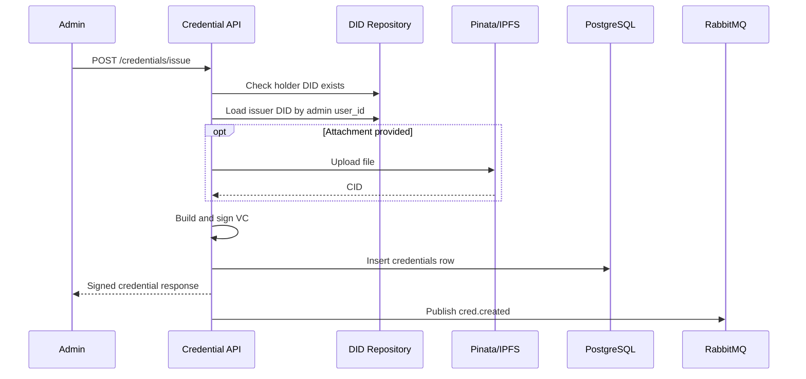
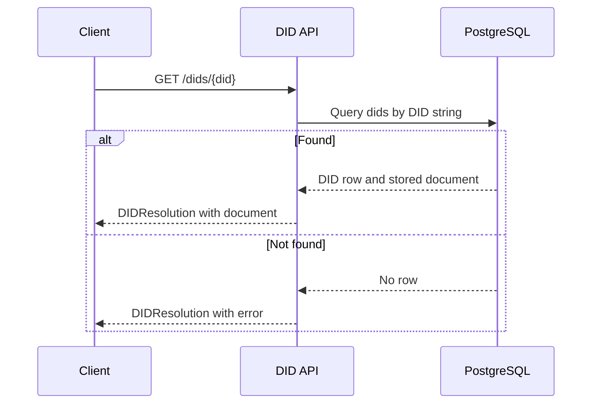

# Backend Flow and Smart Contract Roadmap

## 1. Project Overview

This repository contains the backend for a digital identity wallet built with FastAPI, PostgreSQL, RabbitMQ, and Ethereum-oriented utilities.

At its current stage, the backend is designed to:

- manage platform users and roles;
- derive Ethereum wallets for users from a backend-held HD wallet mnemonic;
- create and resolve `did:ethr`-style decentralized identifiers (DIDs);
- issue, store, list, and revoke verifiable credentials (VCs);
- prepare the codebase for a later blockchain phase without fully implementing smart contract integration yet.

The current implementation is best understood as an off-chain identity and credential backend with blockchain-aware identifiers, hashes, and signatures. It already uses Ethereum-compatible wallet derivation and EIP-191 signatures, but the chain write/read path is still mostly placeholder logic.

## 2. Current Backend Architecture

### Runtime shape

The canonical runtime entry point is `app/src/main.py`, which is also the target used by `docker-compose.yml`:

- `uvicorn app.src.main:app`

That entry point runs a single FastAPI application that includes:

- the auth router;
- the DID router;
- the credential router;
- Prometheus metrics exposure;
- RabbitMQ connection startup;
- subscription to the `user.created` event.

Although the repository also contains `app/src/auth/main.py`, `app/src/did/main.py`, and `app/src/credential/main.py`, those look like earlier service-specific entry points rather than the active deployment model. The current Docker setup runs the consolidated backend in `app/src/main.py`.

### High-level module organization

- `app/src/auth/`: user registration, login, JWT handling, user persistence, role definitions.
- `app/src/did/`: DID creation, DID resolution, DID document generation, telemetry helpers, event handler for auto-creating DIDs after user creation.
- `app/src/credential/`: credential issuance, signing, storage, listing, revocation, optional IPFS upload for attachments.
- `app/src/common/`: shared database helpers, auth dependency helpers, RabbitMQ event bus, pagination, response helpers, exception handlers.
- `app/src/blockchain/`: HD wallet derivation and a small Ethereum account helper.
- `alembic/`: schema migration history.

### Main application entry point

`app/src/main.py` performs the following startup and runtime work:

1. Configures logging.
2. Creates the FastAPI app with a lifespan hook.
3. Connects to RabbitMQ on startup.
4. Subscribes to `user.created`.
5. Includes the auth, DID, and credential routers.
6. Adds CORS middleware with permissive `*` settings.
7. Exposes Prometheus metrics via `prometheus-fastapi-instrumentator`.
8. Registers custom HTTP and generic exception handlers.

### Auth module

The auth module is responsible for:

- registering users in PostgreSQL;
- hashing passwords with `passlib`/bcrypt;
- deriving an Ethereum wallet from a master mnemonic during registration;
- storing `wallet_index`, `eth_address`, and `role`;
- publishing a `user.created` event;
- issuing JWT access tokens at login.

Important implementation detail:

- registration is currently admin-protected because `POST /auth/register` depends on `require_admin`.
- login uses `OAuth2PasswordRequestForm`, so the active login input is form-encoded username/password, not JSON.

### DID module

The DID module is responsible for:

- creating `did:ethr` identifiers for users;
- generating a DID document structure;
- storing DID records and the serialized DID document in PostgreSQL;
- computing a document hash;
- resolving DIDs from the local database;
- publishing a `did.created` event after persistence.

The module also includes OpenTelemetry tracing helpers. Tracing is used around the DID HTTP endpoints, not across the entire application.

### Credential / Verifiable Credential module

The credential module is responsible for:

- issuing verifiable credentials for holder DIDs;
- deriving the issuer wallet from the admin JWT claims;
- signing the VC with an Ethereum private key using EIP-191-style signing;
- storing the signed credential JSON in PostgreSQL;
- optionally uploading an attached file to Pinata/IPFS;
- listing credentials for a user;
- revoking credentials;
- publishing `cred.created` and `cred.revoked` events.

### Common/shared utilities

Shared utilities currently include:

- synchronous SQLAlchemy engine/session factory in `app/src/common/database.py`;
- token parsing and role checks in `app/src/common/auth_dependencies.py`;
- standardized JSON success/error helpers in `app/src/common/response.py`;
- HTTP and general exception handlers in `app/src/common/exceptions.py`;
- simple SQLAlchemy-based pagination in `app/src/common/pagination.py`;
- the RabbitMQ event bus in `app/src/common/messaging.py`.

### Database layer

The backend uses:

- PostgreSQL as the primary database;
- synchronous SQLAlchemy sessions;
- Alembic migrations for schema setup.

The active migration is `alembic/versions/d4561c7722b4_create_initial_tables.py`, which creates:

- `users`
- `dids`
- `credentials`
- `wallet_index_seq`

The later migration `ecd54d347fc9_create_initial_tables.py` is empty and does not change the schema.

### Messaging/event system

RabbitMQ is used through an `aio-pika`-based event bus:

- exchange name: `dididentity`
- exchange type: `topic`
- durable exchange and durable queues
- robust connection with retry attempts
- persistent published messages
- `prefetch_count=10` on the subscriber channel
- message processing with `requeue=True` on failure

In the current active app, only one subscription is enabled:

- `user.created` -> `app.src.did.events.handle_user_created`

Other published events exist but are not actively consumed in `app/src/main.py`.

### Background task usage

FastAPI `BackgroundTasks` are used for asynchronous post-response publishing of:

- `did.created`
- `cred.created`
- `cred.revoked`

This means the HTTP request can complete before the event is published. The backend does not implement an outbox pattern, so event delivery is not transactionally tied to the database commit.

### Telemetry, logging, and exception handling

Current observability and error handling includes:

- module-level `logging.basicConfig(...)` in several files;
- Prometheus metrics on the main app;
- OpenTelemetry tracing only in the DID module;
- JSON exception wrapping:
  - HTTP exceptions return `{status: false, message, data: null}`;
  - unhandled exceptions return HTTP 500 with `Internal Server Error`.

There is no centralized structured logging pipeline or distributed tracing across auth and credential flows yet.

## 3. Main Data Models

The backend currently relies on three main tables plus one PostgreSQL sequence.

### `users`

Purpose:

- stores platform users, login identity, role, and blockchain-derived wallet metadata.

Important fields:

- `id`: primary key.
- `username`: unique login identifier.
- `email`: optional unique email.
- `password_hash`: bcrypt-compatible password hash.
- `wallet_index`: unique HD wallet index derived from `wallet_index_seq`.
- `eth_address`: unique Ethereum address derived from the master mnemonic.
- `role`: enum with values `user`, `admin`, `student`, `teacher`.
- `created_at`: creation timestamp.

Relationships:

- logical one-to-one with `dids.user_id`.
- logical one-to-many with credentials issued by the user in an operational sense, but that relationship is not modeled with a foreign key.

How it is used:

- created during registration;
- looked up during login;
- used by DID creation to derive the target DID from `wallet_index`;
- used by credential issuance to derive the issuer signing wallet.

### `dids`

Purpose:

- stores a locally persisted DID record and the JSON DID document used for resolution.

Important fields:

- `id`: primary key.
- `user_id`: owning user identifier.
- `did`: unique DID string.
- `ethereum_address`: address embedded in the DID.
- `document`: JSON DID document.
- `document_hash`: keccak hash of the serialized DID document.
- `tx_hash`: placeholder for future blockchain transaction hash.
- `block_number`: placeholder for future blockchain block number.
- `active`: boolean status.
- `created_at`, `updated_at`: timestamps.

Relationships:

- logical one-to-one with `users.id`.
- referenced indirectly by `credentials.holder_did` and `credentials.issuer`.

How it is used:

- created automatically after `user.created` or manually through the DID endpoint;
- resolved locally by DID string;
- used as the holder and issuer identifier in credential flows.

### `credentials`

Purpose:

- stores signed verifiable credentials and local revocation metadata.

Important fields:

- `id`: primary key.
- `credential_id`: unique VC identifier, currently `urn:uuid:...`.
- `issuer`: issuer DID string.
- `holder_did`: holder DID string.
- `type`: credential type label.
- `credential`: full signed credential JSON.
- `status`: enum `active`, `revoked`, `expired`.
- `revoked_at`: revocation timestamp.
- `revoked_by`: admin user ID that revoked the credential.
- `revoke_reason`: free-text local reason.
- `created_at`, `updated_at`: timestamps.

Relationships:

- `issuer` and `holder_did` are stored as strings, not foreign keys.
- `revoked_by` is an integer, not a foreign key to `users.id`.

How it is used:

- created by the credential issuance endpoint;
- listed by holder DID;
- revoked locally by updating status fields;
- intended to be mirrored later to smart contracts through published events.

### `wallet_index_seq`

Purpose:

- allocates unique HD wallet indexes for user wallets.

How it is used:

- `auth.repository.get_next_wallet_index()` executes `SELECT nextval('wallet_index_seq')`;
- the resulting index determines the derived Ethereum wallet and address for the user.

### Model relationship notes

The current schema intentionally keeps relationships lightweight:

- there are no SQLAlchemy `ForeignKey` constraints between `users`, `dids`, and `credentials`;
- most cross-model relations are enforced in service logic;
- this simplifies initial development, but future smart contract synchronization will benefit from clearer relational integrity.

## 4. Authentication and Authorization Flow

### Registration flow

Endpoint:

- `POST /auth/register`

Observed behavior:

1. The endpoint requires an authenticated admin token.
2. The service checks for duplicate username.
3. If email is provided, it also checks for duplicate email.
4. It allocates the next `wallet_index`.
5. It derives an Ethereum wallet from the master mnemonic.
6. It creates the user with password hash, wallet index, Ethereum address, and role.
7. It publishes `user.created`.
8. It returns a success response saying DID creation has started.

Important note:

- this is not self-service registration in the current codebase; only admins can create users.

### Login flow

Endpoint:

- `POST /auth/login`

Observed behavior:

1. The endpoint receives `OAuth2PasswordRequestForm`.
2. The service looks up the user by username.
3. It verifies the password hash.
4. It builds a JWT access token.
5. It returns:
   - `access_token`
   - `token_type = bearer`

### JWT/token structure

The visible claims added by `create_access_token()` include:

- `sub`: username
- `user_id`
- `role`
- `wallet_index`
- `eth_address`
- `exp`

There is no refresh token flow in the current repository.

### Current user extraction

There are two styles in the code:

- `app/src/auth/dependencies.py`
  - decodes the JWT and loads the user from the database.
- `app/src/common/auth_dependencies.py`
  - decodes the JWT and constructs a lightweight `CurrentUser` object from token claims.

The application mostly uses the common dependency helpers for router authorization.

### Admin-only access control

Admin checks are enforced by comparing the decoded role with `UserRoleEnum.ADMIN`.

Current admin-protected flows:

- `POST /auth/register`
- `POST /dids/`
- `POST /credentials/issue`
- `POST /credentials/credentials/revoke`

### Role-based behavior

Implemented role behavior is limited.

What exists:

- the enum contains `user`, `admin`, `student`, `teacher`;
- a reusable `require_roles(...)` helper exists.

What is actually used:

- only the admin check is used in active router flows.

Planned/Future Work:

- if students and teachers are meant to have different permissions, that logic is not implemented yet.

## 5. DID Flow

### How DID creation is triggered

DID creation can be triggered in two ways:

1. Automatically after registration:
   - `auth.service.register_user()` publishes `user.created`;
   - `app/src/main.py` subscribes to `user.created`;
   - `did.events.handle_user_created()` creates the DID.
2. Manually through the API:
   - `POST /dids/`
   - requires admin access.

### How DIDs are generated

Current DID generation logic:

1. Load the target user by `user_id`.
2. Read the user's `wallet_index`.
3. Derive the Ethereum wallet from the master mnemonic.
4. Build the DID string:

`did:ethr:{user_id}:{ethereum_address}`

This is a project-specific format. It is Ethereum-oriented, but it is not a plain `did:ethr:<address>` value.

### DID document structure

For the active `ethr` path, the generated DID document includes:

- `@context = https://www.w3.org/ns/did/v1`
- `id = did:ethr:...`
- `controller`
- one verification method:
  - `type = EcdsaSecp256k1RecoveryMethod2020`
  - `blockchainAccountId = eip155:1:{address}`
- `authentication = ["{did}#owner"]`

The code also contains generic branches for `key`, `web`, and fallback methods, but the current creation service only uses the Ethereum-based path.

### How DIDs are stored

After generation:

1. The DID document is serialized to JSON.
2. A keccak hash of that JSON is computed.
3. A `dids` row is created with:
   - `user_id`
   - `did`
   - `document`
   - `ethereum_address`
   - `document_hash`
   - `tx_hash = null`
   - `block_number = null`

This means the current backend treats PostgreSQL as the source of truth for DID resolution, while also preparing fields for future on-chain anchoring.

### How DID resolution works

Endpoint:

- `GET /dids/{did}`

Observed behavior:

1. Query the `dids` table by DID string.
2. If not found, return a DID Resolution object with:
   - `error = "DID not found"`
3. If found:
   - load the stored JSON DID document;
   - construct a DID Resolution response;
   - include `created` and `updated` metadata from the DB row.

There is no live blockchain read during resolution in the current code.

### DID-related events

Published:

- `did.created`

Current payload:

- `user_id`
- `did`
- `method`
- `ethereum_address`
- `tx_hash`
- `block_number`

Consumed:

- no active `did.created` consumer is wired in the main app.

### DID module interaction with auth/user module

The DID module depends directly on auth data:

- it reads the target user from the users table;
- it uses `wallet_index` assigned during registration;
- it uses the derived Ethereum address as part of the DID string and DID document.

### DID flow sequence

## 6. Verifiable Credential Flow

### Credential issuance

Endpoint:

- `POST /credentials/issue`

This is the most complete credential flow currently implemented.

### Required request data

The endpoint expects multipart/form-data with:

- `cred_json`: a JSON string parsed into:
  - `holder_did`
  - `type`
  - `credential_data`
- optional `attachment`: uploaded file

### Holder DID validation

Before issuing a credential, the backend:

1. ensures the admin token includes `wallet_index`;
2. ensures the admin token includes `eth_address`;
3. checks that the holder DID exists in the local `dids` table.

### Issuer resolution

The backend then:

1. derives the issuer wallet from the admin's `wallet_index`;
2. checks that the derived address matches the `eth_address` claim from the token;
3. looks up the issuer DID by `admin_user.user_id`.

If the issuer user does not have a DID record, issuance fails.

### Credential structure

The VC payload currently contains:

- `@context = ["https://www.w3.org/2018/credentials/v1"]`
- `id = urn:uuid:...`
- `type = ["VerifiableCredential", <credential_type>]`
- `issuer = issuer_did`
- `issuanceDate`
- `credentialSubject`

`credentialSubject` is built from:

- the submitted `credential_data`
- `id = holder_did`
- optional `attachedDocument = ipfs://<cid>`

### Signing process

Signing is implemented locally.

Current behavior:

1. The backend canonicalizes the VC payload JSON.
2. It signs the payload using `eth_account` and the issuer's derived Ethereum private key.
3. It adds a `proof` block with:
   - `type = EthereumEip191Signature2026`
   - `created`
   - `proofPurpose = assertionMethod`
   - `verificationMethod`
   - `signature`

This is real off-chain signing logic, not a placeholder.

### Credential storage

After signing:

1. the signed credential is stored in the `credentials` table;
2. the full VC JSON is persisted in the `credential` column;
3. status starts as `active`.

### Credential listing for users

Implemented listing endpoints:

- `GET /credentials/users/auth/credentials`
  - lists credentials for the authenticated user by resolving the user's DID.
- `GET /credentials/users/{user_id}/credentials`
  - lists credentials for a given user ID by looking up that user's DID.

Both use the local database and simple pagination.

Important observation:

- the second endpoint does not currently require authentication.

### Credential retrieval

Implemented endpoint:

- `GET /credentials/credentials/{credential_id}`

This path contains a duplicated `/credentials` segment because the router prefix is already `/credentials`.

### Credential revocation

Implemented endpoint:

- `POST /credentials/credentials/revoke`

Observed behavior:

1. admin-only access;
2. load credential by `credential_id`;
3. fail if not found;
4. fail if already revoked;
5. set:
   - `status = revoked`
   - `revoked_at`
   - `revoked_by`
   - `revoke_reason`
6. commit to PostgreSQL;
7. publish `cred.revoked`.

### Credential-related events

Published:

- `cred.created`
- `cred.revoked`

Consumed:

- no active consumer is implemented in the main app;
- `app/src/credential/events.py` contains a stub `handle_did_created()` only.

### Credential issuance sequence

## 7. Event-Driven Communication

### Current event bus usage

The current event bus is RabbitMQ-based and topic-oriented.

Published events visible in the code:

- `user.created`
- `did.created`
- `cred.created`
- `cred.revoked`

### Subscribed events

Active subscription in the main app:

- `user.created` -> automatic DID creation

Inactive or planned subscriptions:

- `did.created` consumer is commented out
- credential-side event handling is not implemented

### Which modules communicate through events

- auth -> DID:
  - registration emits `user.created`
  - DID event handler consumes it
- DID -> future blockchain/credential consumer:
  - DID creation emits `did.created`
- credential -> future blockchain/audit consumer:
  - issuance emits `cred.created`
  - revocation emits `cred.revoked`

### Why events are used in the current design

Events are being used to separate primary request handling from follow-up identity operations:

- user registration can complete before DID handling finishes;
- DID/credential blockchain anchoring can be added later without forcing the request thread to wait on chain finality;
- the architecture is already moving toward service decomposition, even though the deployed runtime is currently consolidated.

### Reliability and lifecycle considerations

Visible strengths:

- durable exchange and queues;
- persistent messages;
- reconnect logic via `aio_pika.connect_robust`;
- requeue on handler failure.

Visible limitations:

- no outbox pattern;
- no idempotency guard for re-delivered events;
- no dead-letter queue strategy;
- startup currently proceeds even though the `connect()` return value is not enforced;
- `did.created`, `cred.created`, and `cred.revoked` are currently emitted without an active consumer in the main runtime.

## 8. End-to-End Backend Flows

### User registration to DID creation

1. An admin calls `POST /auth/register`.
2. The backend validates uniqueness of username and optional email.
3. The backend allocates a new `wallet_index`.
4. The backend derives the Ethereum wallet from the master mnemonic.
5. The backend stores the new user in PostgreSQL.
6. The backend publishes `user.created`.
7. The `user.created` event handler loads the user.
8. The DID service derives the same wallet again from `wallet_index`.
9. The DID service creates `did:ethr:{user_id}:{address}`.
10. The DID document is generated and stored in the `dids` table.
11. The DID service publishes `did.created`.

### User login and authenticated requests

1. A client submits username/password to `POST /auth/login`.
2. The backend verifies the password hash.
3. The backend returns a bearer access token containing username, user ID, role, wallet index, and Ethereum address.
4. Protected endpoints decode the token with `OAuth2PasswordBearer`.
5. Admin-only routes reject callers whose role is not `admin`.
6. Credential issuance also relies on the token's `wallet_index` and `eth_address` claims to derive the issuer signing key.

### Admin credential issuance

1. An admin sends `POST /credentials/issue`.
2. The backend parses `cred_json` and optional file upload.
3. The backend confirms the holder DID exists locally.
4. The backend derives the issuer wallet from the admin token's `wallet_index`.
5. The backend confirms the derived address matches the token's `eth_address`.
6. The backend loads the issuer DID from the `dids` table.
7. If a file is present, the backend uploads it to Pinata and gets an IPFS CID.
8. The backend builds the VC payload.
9. The backend signs the VC locally with the issuer private key.
10. The backend stores the signed VC in the `credentials` table.
11. The backend publishes `cred.created`.
12. The backend returns the signed credential in the response.

### User viewing their credentials

1. An authenticated user calls `GET /credentials/users/auth/credentials`.
2. The backend extracts the user ID from the token.
3. The backend loads the user's DID from the `dids` table.
4. The backend queries `credentials` by `holder_did`.
5. The backend returns paginated credential records, including revocation metadata if present.

### Admin credential revocation

1. An admin calls `POST /credentials/credentials/revoke`.
2. The backend loads the credential by `credential_id`.
3. The backend checks whether it is already revoked.
4. The backend updates status and revocation metadata.
5. The backend commits the change to PostgreSQL.
6. The backend publishes `cred.revoked`.
7. The backend returns the updated status.

### DID resolution

1. A client calls `GET /dids/{did}`.
2. The backend looks up the DID in PostgreSQL.
3. If not found, it returns a DID Resolution object with an error field.
4. If found, it loads the stored DID document JSON.
5. The backend returns a DID Resolution response with document metadata from the local row.

### DID resolution sequence

## 9. Current Blockchain Integration Status

### What already exists

The backend already contains real blockchain-oriented building blocks:

- HD wallet derivation from a master mnemonic;
- per-user deterministic Ethereum addresses via `wallet_index`;
- `did:ethr`-style DID identifiers;
- DID document `blockchainAccountId` values;
- keccak hashing of DID documents;
- keccak hashing of signed credentials;
- Ethereum private-key signing of credentials;
- DB fields reserved for `tx_hash` and `block_number`.

### What is still placeholder or incomplete

The following areas are not implemented end-to-end:

- actual DID registration on-chain:
  - `app/src/did/blockchain.py::register_did_on_chain()` is a stub;
- on-chain DID resolution:
  - current resolution reads only from PostgreSQL;
- on-chain credential issuance proof:
  - `cred.created` is emitted, but no contract write happens;
- on-chain credential verification:
  - there is no verification endpoint or blockchain lookup;
- on-chain credential revocation:
  - `cred.revoked` is emitted, but no contract write happens;
- issuer authority management:
  - admin trust exists only in the local database/JWT role model;
- chain/network configuration:
  - the DID document hardcodes `eip155:1`, while the runtime does not yet expose a full chain integration layer.

### Current IPFS status

IPFS is partially integrated for attachments only:

- files can be uploaded to Pinata;
- the returned CID is stored as `ipfs://...` inside `credentialSubject.attachedDocument`;
- the VC itself is still stored in PostgreSQL, not on IPFS by default.

### Where the backend is already expecting future smart contract integration

The code clearly anticipates later blockchain wiring in these places:

- DID creation has commented contract-call placeholders and stores `tx_hash`/`block_number` fields.
- Credential issuance publishes a hash-oriented event specifically suited to a registry contract.
- Credential revocation publishes a revocation event suitable for a revocation registry.
- Comments in code explicitly mention future blockchain checks and submission steps.

## 10. Smart Contracts Required for the Next Phase

The next phase should not try to move full identity data on-chain. It should anchor trust, integrity, and revocation on-chain while keeping sensitive payloads off-chain.

### 10.1 DIDRegistry Contract

Purpose:

- register DID ownership and a hash or URI reference to the DID document.

Used by:

- DID creation flow;
- DID resolution flow.

Main data stored on-chain:

- DID string or a normalized DID key;
- controller/owner address;
- DID document hash;
- optional document URI or service endpoint reference;
- active/deactivated status;
- block timestamps or update counters.

Main functions/events needed:

- `registerDid(...)`
- `updateDidDocumentHash(...)`
- `deactivateDid(...)`
- `getDidRecord(...)`
- events such as `DidRegistered`, `DidUpdated`, `DidDeactivated`

Why it is necessary:

- the backend already creates DID records and hashes documents;
- anchoring ownership and document integrity on-chain is the most direct extension of the current DID flow.

### 10.2 IssuerRegistry / AuthorityRegistry Contract

Purpose:

- manage trusted issuers that are allowed to issue credentials.

Used by:

- credential issuance;
- credential verification;
- admin/authority trust validation.

Main data stored on-chain:

- issuer DID or issuer address;
- authority status;
- optional metadata URI;
- activation/revocation timestamps.

Main functions/events needed:

- `authorizeIssuer(...)`
- `revokeIssuer(...)`
- `isAuthorizedIssuer(...)`
- events such as `IssuerAuthorized`, `IssuerRevoked`

Why it is necessary:

- today, trust in an issuer is only an off-chain `admin` role;
- for verifiable credentials, external verifiers need an on-chain trust root or authoritative registry.

### 10.3 CredentialRegistry Contract

Purpose:

- anchor proof that a credential was issued without storing the full credential on-chain.

Used by:

- credential issuance;
- future credential verification.

Main data stored on-chain:

- `credential_id`;
- credential hash;
- issuer DID or issuer address;
- holder DID reference or holder identifier hash;
- schema/type reference;
- issuance timestamp;
- optional off-chain URI.

Main functions/events needed:

- `registerCredential(...)`
- `getCredentialRecord(...)`
- `credentialExists(...)`
- events such as `CredentialIssued`

Why it is necessary:

- the backend already computes a credential hash and publishes `cred.created`;
- this contract gives verifiers proof that a credential existed and was issued by a trusted authority.

### 10.4 CredentialRevocationRegistry Contract

Purpose:

- provide an on-chain revocation check.

Used by:

- credential revocation;
- future verifier read path.

Main data stored on-chain:

- revoked/not revoked status by credential ID or hash;
- revocation timestamp;
- revoking authority;
- optional compact reason code.

Main functions/events needed:

- `revokeCredential(...)`
- `isRevoked(...)`
- `getRevocation(...)`
- events such as `CredentialRevoked`

Why it is necessary:

- the current backend supports local revocation only;
- verifiers outside this database need a shared revocation source.

Design note:

- this could be a separate contract or part of `CredentialRegistry`;
- a separate contract is clean if revocation logic will evolve independently.

### 10.5 CredentialSchemaRegistry Contract

Purpose:

- register supported credential types or schema references.

Used by:

- credential issuance validation;
- future verifier tooling;
- governance over allowed credential types.

Main data stored on-chain:

- schema ID or type name;
- schema URI or IPFS CID;
- version;
- active/deprecated flag.

Main functions/events needed:

- `registerSchema(...)`
- `deprecateSchema(...)`
- `getSchema(...)`
- events such as `SchemaRegistered`, `SchemaDeprecated`

Why it is useful:

- the current backend accepts arbitrary `type` strings;
- a schema registry becomes important once multiple VC types need consistent validation and verifier trust.

Necessity level:

- useful, but less urgent than DID, issuer, issuance, and revocation contracts.

### 10.6 NFTCertificate / AchievementCredential Contract

Assessment:

- not necessary for the current backend phase.

Reason:

- the implemented credential flow is focused on verifiable identity/authority credentials, not transferable collectible assets;
- the code only contains a comment about a possible future NFT attachment use case;
- adding ERC-721 or similar logic now would complicate the trust model without solving the current core need.

Recommendation:

- keep NFT-based certificates as Future Work unless the product explicitly needs public, user-owned, transferable certificate tokens.

## 11. Backend-to-Smart-Contract Integration Points

This section maps future contract calls to the current backend code.

### DID creation

Existing location:

- `app/src/did/service.py` -> `create_did_service(...)`

Current behavior:

- derives wallet;
- builds DID string;
- generates DID document;
- hashes the document;
- stores the DID row locally;
- publishes `did.created`.

Future blockchain behavior:

- call `DIDRegistry.registerDid(...)` before or after the local DB write;
- store returned `tx_hash` and `block_number`;
- ideally confirm event emission and persist the anchor reference.

Expected contract call:

- `registerDid(did, ownerAddress, documentHash, documentUriOrEndpoint)`

Data that should be sent on-chain:

- DID identifier or normalized key;
- owner/controller address;
- DID document hash;
- optional URI/reference.

Data that should remain off-chain:

- full DID document JSON;
- internal user ID if not required externally;
- any future private metadata.

Recommended architecture:

- keep the current `did.created` event and let a dedicated blockchain worker submit the transaction asynchronously.

### DID resolution

Existing location:

- `app/src/did/service.py` -> `resolve_did_service(...)`

Current behavior:

- resolves only from PostgreSQL.

Future blockchain behavior:

- optionally read the DID anchor from `DIDRegistry`;
- compare DB-cached hash with on-chain hash;
- if a document URI is stored on-chain, fetch the off-chain document and verify its hash.

Expected contract call:

- `getDidRecord(did)`

Data that should be sent/read on-chain:

- DID identifier;
- document hash;
- owner/controller;
- active state.

Data that should remain off-chain:

- full DID document body;
- local caching metadata.

### Credential issuance

Existing location:

- `app/src/credential/router.py` -> `issue_credential(...)`

Current behavior:

- validates holder DID;
- resolves issuer DID;
- signs the VC locally;
- stores the full signed VC in PostgreSQL;
- publishes `cred.created` with a hash.

Future blockchain behavior:

- verify the issuer is authorized in `IssuerRegistry`;
- optionally verify the credential type against `CredentialSchemaRegistry`;
- register credential issuance in `CredentialRegistry`.

Expected contract calls:

- `isAuthorizedIssuer(issuerAddress or issuerDid)`
- `isSupportedSchema(schemaId)` if schema registry is used
- `registerCredential(credentialId, credentialHash, issuer, holderRef, schemaRef, issuedAt, uri)`

Data that should be sent on-chain:

- `credential_id`;
- credential hash;
- issuer identifier/address;
- holder DID or holder DID hash;
- credential type or schema reference;
- issuance timestamp;
- optional off-chain URI/CID.

Data that should remain off-chain:

- full credential subject data;
- personal identity fields;
- attachment file contents;
- full signed VC JSON.

### Credential verification

Existing status:

- there is no dedicated verification endpoint yet.

Current behavior:

- listing and retrieval are database reads only;
- comments mention future blockchain proof checking.

Future blockchain behavior:

- add a verification service that:
  - checks credential hash presence in `CredentialRegistry`;
  - checks issuer authority in `IssuerRegistry`;
  - checks revocation in `CredentialRevocationRegistry`;
  - optionally checks schema status in `CredentialSchemaRegistry`.

Expected contract calls:

- `getCredentialRecord(...)`
- `isAuthorizedIssuer(...)`
- `isRevoked(...)`
- optional schema lookup

### Credential revocation

Existing location:

- `app/src/credential/router.py` -> `revoke_credential(...)`

Current behavior:

- updates local credential status and publishes `cred.revoked`.

Future blockchain behavior:

- call the revocation contract and keep local DB state as an indexed cache/audit store.

Expected contract call:

- `revokeCredential(credentialId, reasonCode)`

Data that should be sent on-chain:

- credential ID or credential hash;
- revocation status;
- revocation time;
- revoking authority;
- compact reason code if desired.

Data that should remain off-chain:

- free-text revoke reason if it contains sensitive context;
- internal audit notes.

### Issuer/admin validation

Existing locations:

- `app/src/common/auth_dependencies.py`
- `app/src/credential/router.py` -> `issue_credential(...)`

Current behavior:

- the backend trusts the JWT role claim for admin authorization.

Future blockchain behavior:

- local admin role can remain the API access gate;
- smart contracts should separately validate whether the issuer is trusted on-chain.

Expected contract call:

- `isAuthorizedIssuer(issuerAddress or issuerDid)`

Practical split:

- API permission stays off-chain;
- issuer trust for verifiable credentials should become on-chain or at least anchored on-chain.

## 12. On-Chain vs Off-Chain Data Design

The current project should use blockchain for integrity and trust proofs, not as a database for personal identity payloads.

### Recommended on-chain data

- DID ownership/controller address
- DID document hash
- optional DID document URI/reference
- issuer authorization status
- credential ID
- credential hash
- credential issuance metadata
- credential revocation status
- schema identifiers and schema URIs

### Recommended off-chain data

- usernames
- emails
- password hashes
- full DID document JSON
- full credential JSON
- `credentialSubject` personal data
- attachments and uploaded files
- verbose revoke reasons
- operational audit logs

### Privacy considerations

Sensitive personal data should not be written directly to public or consortium chain state.

Why:

- credentials may contain names, national IDs, student IDs, faculty details, and similar personal data;
- on-chain data is hard or impossible to delete;
- privacy laws and institutional security policies generally favor keeping personally identifiable information off-chain.

Recommended pattern:

1. Store the full credential off-chain in PostgreSQL and optionally IPFS.
2. Hash the canonical credential representation.
3. Store only the hash and minimal issuance metadata on-chain.
4. Verify off-chain content later by recomputing the hash.

For DIDs:

- storing the DID itself and its controller address on-chain is reasonable;
- storing a document hash is reasonable;
- storing the full DID document is usually unnecessary unless the document is intentionally public and very small.

## 13. Suggested Smart Contract Events

The backend already uses an event-driven style internally, so future contracts should also emit clear events that can be indexed by a blockchain worker or read by the backend.

### `DidRegistered`

Parameters:

- `did`
- `owner`
- `documentHash`
- `documentUri`

Used by:

- DID creation flow;
- local DB synchronization;
- audit/indexing.

Why useful:

- confirms DID anchoring and gives the backend the transaction/event proof to store.

### `DidUpdated`

Parameters:

- `did`
- `newDocumentHash`
- `newDocumentUri`

Used by:

- future DID update flow;
- cache invalidation for the local DID store.

Why useful:

- keeps local resolution caches consistent with chain state.

### `DidDeactivated`

Parameters:

- `did`
- `owner`

Used by:

- future DID deactivation flow;
- resolution status tracking.

Why useful:

- verifiers need to know when a DID should no longer be trusted.

### `IssuerAuthorized`

Parameters:

- `issuerDid` or `issuerAddress`
- `authorizedBy`

Used by:

- issuer onboarding;
- credential issuance pre-checks.

Why useful:

- external systems can verify trusted issuers without database access.

### `IssuerRevoked`

Parameters:

- `issuerDid` or `issuerAddress`
- `revokedBy`

Used by:

- issuer governance;
- verifier trust decisions.

Why useful:

- supports immediate removal of issuer trust.

### `CredentialIssued`

Parameters:

- `credentialId`
- `credentialHash`
- `issuerDid` or `issuerAddress`
- `holderRef`
- `schemaRef`
- `issuedAt`

Used by:

- credential issuance flow;
- verification services;
- analytics/auditing.

Why useful:

- gives a durable public proof that a credential existed and who issued it.

### `CredentialRevoked`

Parameters:

- `credentialId`
- `revokedBy`
- `revokedAt`
- optional `reasonCode`

Used by:

- revocation flow;
- verifier status checks.

Why useful:

- revocation is one of the most important verifier-facing state changes.

### `SchemaRegistered`

Parameters:

- `schemaId`
- `schemaUri`
- `version`

Used by:

- schema governance;
- issuance validation.

Why useful:

- helps clients and verifiers understand supported VC types.

## 14. Suggested Implementation Order

A practical implementation order, based on the current codebase, is:

1. Freeze the DID format and target chain assumptions.
2. Decide whether blockchain writes will happen inline or through a dedicated event consumer.
3. Implement `DIDRegistry`.
4. Connect `app/src/did/service.py` or a `did.created` worker to `DIDRegistry`.
5. Start persisting `tx_hash` and `block_number` for DID records.
6. Implement `IssuerRegistry` and define how local admins become authorized issuers on-chain.
7. Implement `CredentialRegistry`.
8. Wire `cred.created` to on-chain credential registration.
9. Implement `CredentialRevocationRegistry` or add revocation logic to `CredentialRegistry`.
10. Wire `cred.revoked` to on-chain revocation writes.
11. Add a credential verification service that checks:
    - local credential payload;
    - on-chain issuance proof;
    - issuer trust;
    - revocation state.
12. Implement `CredentialSchemaRegistry` if multiple VC types are going to be supported formally.
13. Add deployment scripts, contract ABIs, environment configuration, and integration tests.
14. Add failure handling for chain-write retries, idempotency, and reprocessing.

Recommended architectural choice:

- use the existing RabbitMQ events as the blockchain integration seam.

Reason:

- the backend already emits the right domain events;
- asynchronous chain writes fit better with transaction confirmation delays;
- the current HTTP handlers stay responsive.

## 15. Open Questions and TODOs

The following points should be resolved before full smart contract work begins:

- Is registration intentionally admin-only, or should end users self-register later?
- Is the canonical deployment model the monolithic `app/src/main.py`, or should the per-module `main.py` files become real standalone services?
- Should the DID format remain `did:ethr:{user_id}:{address}`, or should it move closer to a standard `did:ethr:<address>` representation?
- Which chain ID should be used? The DID document currently hardcodes `eip155:1`, but the backend does not yet prove it is operating on Ethereum mainnet.
- Should one user always have exactly one DID? The current service enforces that.
- Should `GET /credentials/users/{user_id}/credentials` and `GET /credentials/credentials/{credential_id}` remain publicly accessible?
- Should the VC `proof.verificationMethod` align exactly with the DID document verification method fragment? Current code uses `#controller` in the VC proof and `#owner` in the generated DID document.
- Should full DID documents remain in PostgreSQL only, or also be stored in IPFS/object storage with on-chain hash anchoring?
- How should the master HD wallet mnemonic be protected operationally, since the backend can derive every user issuer key from it?
- Should issuer authority depend only on local admin roles, or also on explicit issuer onboarding records?
- Should revocation reasons be public, coded, or private?
- What retry and reconciliation process should exist if a DB commit succeeds but blockchain submission fails later?
- Should `did.created`, `cred.created`, and `cred.revoked` be consumed by a dedicated blockchain worker service?
- Should database foreign keys be added before deeper blockchain integration?
- Should a formal credential verification endpoint be added before on-chain work, so the verification contract interface can be designed against a real backend API?
- The repository currently has no committed backend test suite; contract integration should not begin without automated tests for registration, DID creation, issuance, and revocation flows.

## Appendix: Current API Surface Observed in Code

Auth:

- `POST /auth/register`
- `POST /auth/login`

DID:

- `POST /dids/`
- `GET /dids/{did}`

Credentials:

- `POST /credentials/issue`
- `GET /credentials/users/auth/credentials`
- `GET /credentials/users/{user_id}/credentials`
- `GET /credentials/credentials/{credential_id}`
- `POST /credentials/credentials/revoke`

This appendix lists the routes exactly as mounted by the current router configuration, including duplicated path segments where they exist in code.
